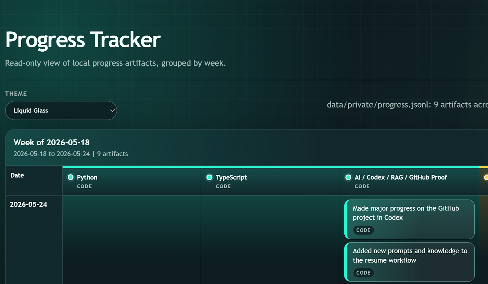

<div align="center">

# Progress Tracker

**Local-first progress intelligence for turning small daily actions into visible proof of momentum.**

<p>
  
  
  
  
  
  
  
  
</p>



</div>

Progress Tracker is a lightweight visual system for recording **progress artifacts**: small completed actions grouped by custom lanes such as learning a programming language, studying a real language, building a portfolio, practicing interviews, writing, fitness, or any long-running personal project.

It is not a task manager, diary, or streak app. The core loop is:

```text
small action -> short artifact -> visible grid -> competence signal -> next action
```

## Why It Exists

Most productivity tools optimize for tasks, timers, or streaks. This project optimizes for something narrower: making real progress visible with almost no input friction.

The intended workflow is intentionally minimal: say or type a short daily update, let AI classify it into predefined lanes, save structured artifacts, and see the week fill up as a compact visual map. The current MVP is local and read-only; the next step is an ingestion endpoint for voice or chat-based capture.

## What Makes It Different

- **Artifact-oriented:** tracks completed evidence, not intentions.
- **Local-first:** private data lives in `data/private/` and is ignored by git.
- **AI-friendly storage:** JSONL keeps each artifact atomic, diffable, and easy for agents to inspect or edit safely.
- **Zero backend MVP:** static HTML, CSS, and vanilla JavaScript served by a local static file server.
- **Flexible visualization:** lanes are loaded from data files, so the same UI can track software learning, language practice, portfolio work, habits, or experiments.
- **Low-friction future path:** speech-to-text or chat input can become structured progress without forcing manual form entry.

## UI And Style

The default interface uses a **Liquid Glass** visual direction: dark-first surfaces, translucent panels, cyan and acid highlights, soft blur, and high-contrast artifact chips. It is designed to make a simple progress table feel closer to a polished product surface than a spreadsheet.

The app also includes a local theme selector with five visual directions:

- **Liquid Glass:** dark translucent UI with neon cyan and soft glow.
- **Dopamine Bento:** bright, playful, warm, and saturated.
- **Editorial Pop:** print-inspired contrast, sharp lines, and strong typography.
- **Tactile Craft:** warm paper-like surfaces and earthy category colors.
- **Calm Focus:** restrained productivity styling with accessible color roles.

Skill lanes use semantic group colors so different progress vectors are visually distinct. Programming and AI work, language learning, career material, and lifestyle projects can each carry their own color family without changing the underlying data.

For public demos or portfolio screenshots, prefer a browser viewport around `1600 x 1000` px. This shows the header, theme selector, week heading, and enough of the grid to communicate the product. If the README image feels too large, export the same crop at `1440 x 900` px and keep the file under roughly `1 MB`.

## Architecture

```text
progress-tracker/
  app/
    index.html        # static shell
    styles.css        # responsive table/chip UI
    tracker.js        # JSONL loading, validation, grouping, rendering
  data/
    examples/         # safe public sample data
    private/          # local real data, ignored by git
  prompts/
    parse-progress.md # generic AI parsing prompt
  scripts/
    serve-progress-tracker-caddy.ps1 # primary Windows launcher
    serve-progress-tracker.ps1       # Python fallback launcher
    install-windows-startup-task.ps1 # Task Scheduler installer
    install-macos-launchagent.sh     # LaunchAgent installer
  start-server.vbs    # legacy hidden startup script on Windows
```

Data flow:

```text
JSONL artifacts + vector list
        |
        v
vanilla JS loader and validator
        |
        v
weekly progress grid
```

## Data Model

Each line is one artifact:

```json
{"id":"2026-01-15-001","date":"2026-01-15","vector":"Learning","text":"Reviewed JSONL validation rules for artifact imports","minutes":20}
```

Required fields: `id`, `date`, `vector`, `text`.

Optional fields: `minutes`, `link`.

## Quick Start

The preferred local server is Caddy:

```powershell
caddy file-server --listen 127.0.0.1:8787 --root . --access-log
```

If Caddy is not installed yet:

```powershell
scoop install caddy
```

On macOS:

```bash
brew install caddy
caddy file-server --listen 127.0.0.1:8787 --root . --access-log
```

Windows fallback, using Python's built-in server:

```powershell
python -m http.server 8787 --bind 127.0.0.1
```

Open:

```text
http://127.0.0.1:8787/app/
```

The app first tries local private files:

```text
data/private/progress.jsonl
data/private/vectors.md
```

If they are missing, it falls back to safe public examples:

```text
data/examples/progress.sample.jsonl
data/examples/vectors.sample.md
```

## Startup

Windows, primary Caddy startup:

```powershell
powershell -NoProfile -ExecutionPolicy Bypass -File .\scripts\install-windows-startup-task.ps1 -Mode Caddy
```

Windows, fallback Python startup:

```powershell
powershell -NoProfile -ExecutionPolicy Bypass -File .\scripts\install-windows-startup-task.ps1 -Mode Python
```

Remove the Windows startup task:

```powershell
powershell -NoProfile -ExecutionPolicy Bypass -File .\scripts\uninstall-windows-startup-task.ps1
```

macOS, Caddy LaunchAgent startup:

```bash
bash scripts/install-macos-launchagent.sh
```

The old `start-server.vbs` file is kept only as a legacy fallback until the new startup task has been tested after login.

## Privacy

Real progress data is intentionally excluded from version control:

```gitignore
data/private/*
backup/
*.log
.env
```

The repository is designed to publish the product and architecture while keeping personal vectors, notes, and progress history local.

## Scientific Grounding

The design is inspired by several established behavior and productivity patterns:

- **Small wins / Progress Principle:** visible progress can reinforce motivation and creative work.
- **Self-monitoring with feedback:** behavior is easier to adjust when the signal is visible and timely.
- **Implementation intentions:** predefined lanes reduce ambiguity when converting action into record.
- **Behavioral activation:** small concrete actions can help restart motion when motivation is low.
- **Quantified Self:** personal data becomes useful when it is structured enough to reveal patterns.
- **Contribution graphs:** compact visual history makes consistency and gaps immediately legible.

## AI-Assisted Roadmap

- **Voice capture:** speak for one minute, transcribe, parse, and save artifacts.
- **Parser endpoint:** expose a small write API via Google Apps Script, local service, or another lightweight endpoint.
- **Theme system:** switch visual styles without changing data.
- **Multiple views:** week, month, heatmap, timeline, and lane summaries.
- **Import/export:** keep JSONL as the portable source of truth.
- **Agent workflow:** let coding agents safely add, validate, and refactor records because the format is plain text.

## Positioning

Progress Tracker sits between habit trackers, time trackers, journals, and GitHub-style contribution graphs.

It does not ask "Did you complete the habit?" or "How many hours did you spend?"

It asks:

> What small artifact did you create today, and where does it move you?

That makes it useful for people building skills, portfolios, habits, career transitions, or any multi-month effort where the hardest part is not planning the work, but seeing that the work is actually accumulating.
